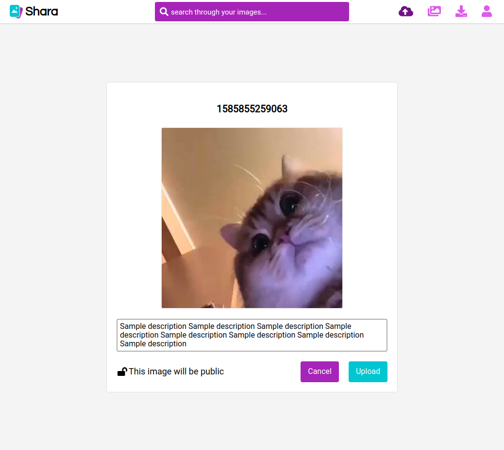
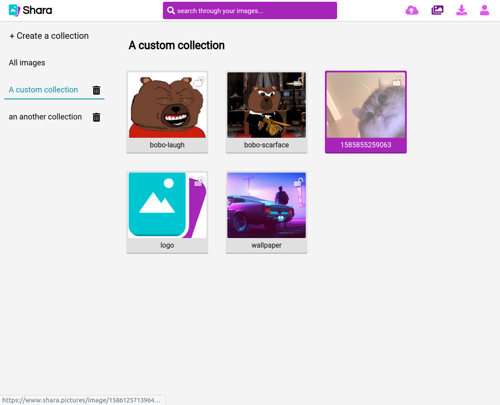
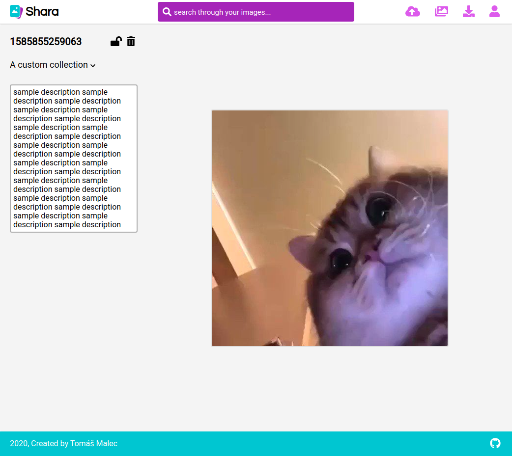
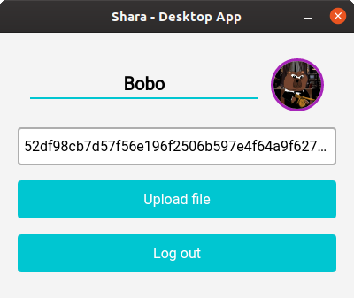
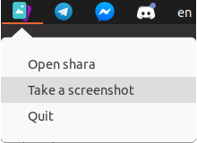

# **Shara**

Shara is a web service, which allows users to store images, which can be managed and assigned to custom collections.

The service is composed of 3 components:
* [Serverless backend](#Serverless-backend)
* [Web application](#Web-application)
* [Desktop application](#Desktop-application)

# **Serverless backend**

The back-end utilizes various services provided by [AWS](https://aws.amazon.com/) alongside with the [Serverless framework](https://serverless.com/).

## **Backend deployment**

### **Prerequisities**
* [NodeJS 12.16.1 or later](https://nodejs.org/en/)
* [NPM installed](https://www.npmjs.com/)
* Serverless framework globally installed - ``npm i -g serverless``
* an [AWS](https://aws.amazon.com/) account

1. [Configure AWS credentials](https://serverless.com/framework/docs/providers/aws/cli-reference/config-credentials/)
2. Navigate yourself to the backend folder of the cloned repository and run `npm i && npm run createConfig`

### **Locally** (kinda)
1. Create a "tls" folder in the root of the cloned repository, create and place a self-signed tls certificate and CA's private key in there and name them "cert.pem" and "key.pem".
2. Set every property except "domain" in config.json. Set the propery "websiteUrl" to "```https://127.0.0.1:[PORT - default 8080]```"
3. run `sls deploy` to deploy necessary resources
4. run `npm run dev`
5. The terminal will output all available api endpoints. This will be required when [locally deploying the web application](#Web-app-deployment) and [desktop application](#Desktop-app-deployment).

# **Web application**

The web application is the user's main interface for using this service. In order to upload an image, the user must first generate an account. Each account has it's hash, which is used for logging in. When logged in the user can create/delete named collections, set his account's name and avatar, upload images and manage them afterwards. Images can be public or private. Public images can be accessed by anyone via their url. Private images can be accessed only by their owner.

#### Uploading an image


#### An example of a collection


#### Viewing an uploaded image


## **Web app deployment**

### **Prerequisities**
* [NodeJS 12.16.1 or later](https://nodejs.org/en/)
* [NPM installed](https://www.npmjs.com/)

1. Navigate yourself to the frontend folder of the cloned repository and run `npm i && npm run createConfig`

### **Locally**

1. [Locally deploy the backend](#backend-deployment)
2. in config.json set the "apiUrl" property to the base url of the api (default `https://localhost:3000/dev`)
3. run `npm run dev`

# **Desktop application**

The desktop application allows the user to upload images, change account's name or avatar and take screenshots, which are immediately uploaded. It utilizes the [Electron framework](https://www.electronjs.org/). In order to use the application the user must first log in to an account and then one can either upload an image via button in the menu or take a screenshot via option in the tray menu or via keyboard shortcut (Command or CTRL + ALT + P).

#### App menu


#### Taking a screenshot via tray menu


## **Desktop app deployment**

### **Prerequisities**
* [NodeJS 12.16.1 or later](https://nodejs.org/en/)
* [NPM installed](https://www.npmjs.com/)

1. Navigate yourself to the electron-app folder of the cloned repository and run `npm i && npm run createConfig`

### **Locally**

1. [Locally deploy the backend](#backend-deployment)
2. [Locally deploy the web application](#Web-app-deployment)
3. in config.json set the "apiUrl" property to the base url of the api (default `https://localhost:3000/dev`) and websiteUrl to the url of the website (default `https://127.0.0.1:8080`)
4. run `npm run dev`
5. in another terminal run `npm run start`